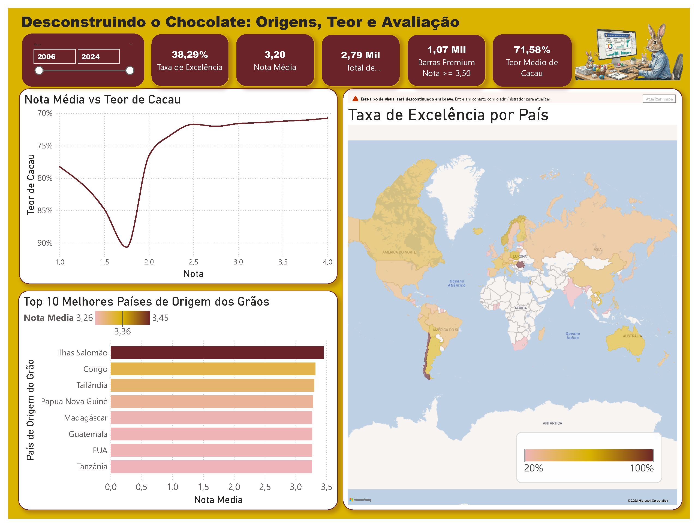

# ✨ Desconstruindo o Chocolate: Origens, Teor e Avaliação (2006-2024)



## 📖 Sobre o Projeto
Este repositório contém uma análise detalhada do dataset **Flavors of Cacao**, abrangendo quase duas décadas (2006-2024) de avaliações de chocolates ao redor do mundo. O projeto combina o poder do **Python** para ETL (Extração, Transformação e Carga) e o **Power BI** para visualizações de alto impacto.

O objetivo principal foi entender quais fatores (origem do grão, teor de cacau, localização do fabricante) mais influenciam na nota final de um chocolate "Premium".

---

## 📊 Principais Insights
Com base na análise de mais de **2.790 registros**, destacam-se os seguintes pontos:

*   **O "Sweet Spot" do Cacau**: A maior concentração de barras com selo de excelência (notas >= 3,5) possui um teor médio de **71,58%**. Chocolates com teores extremamente altos (90%+) tendem a receber notas menores se não houver um equilíbrio excepcional no processamento.
*   **Origens de Elite**: Ilhas Salomão, Congo e Tailândia lideram o ranking de melhor nota média por país de origem do grão.
*   **Amostra Robusta**: Foram mapeadas **1,07 mil barras Premium**, demonstrando uma maturidade crescente no mercado de chocolates finos nos últimos anos.
*   **Taxa de Excelência**: 38,29% das barras analisadas atingiram critérios de alta qualidade.

---

## 🛠️ Tecnologias Utilizadas

### **Data Engineering (Python)**
*   **Pandas**: Manipulação e limpeza de dados complexos.
*   **Deep Translator (Google API)**: Tradução automatizada de mais de 70 nomes de países e localizações para o português.
*   **KaggleHub**: Integração direta para download automático da versão mais recente do dataset.
*   **Standardization**: Conversão de tipos de dados e padronização de decimais para compatibilidade total com o Power BI brasileiro.

### **Data Visualization (Power BI)**
*   Dashboard interativo com filtros temporais (2006-2024).
*   Mapas de calor por taxa de excelência.
*   Análise de correlação entre Teor vs. Nota Média.

---

## 📂 Estrutura do Repositório

```text
├── data/
│   ├── datasets/    # Arquivos brutos baixados via API
│   └── processed/   # CSV final limpo e traduzido pronto para o BI
├── notebooks/
│   └── preprocessed.ipynb  # Script completo de limpeza e tradução
├── reports/
│   ├── Flavors_of_cacao_2006_2024_report.pbix  # Arquivo do Power BI
│   ├── Flavors_of_cacao_2006_2024_report.png   # Screenshot do Dashboard
│   └── Flavors_of_cacao_2006_2024_report.pdf   # Relatório em PDF
└── README.md
```

---

## 🚀 Como Executar

1.  **Clone o repositório**:
    ```bash
    git clone https://github.com/cidade-felipe/Flavors-of-Cacao-2006-2024.git
    ```
2.  **Instale as dependências**:
    ```bash
    pip install pandas kagglehub deep_translator
    ```
3.  **Execute o Notebook**:
    Rode o arquivo `notebooks/preprocessed.ipynb` para baixar os dados mais recentes e gerar o arquivo processado em `data/processed/`.
4.  **Abra o Power BI**:
    Utilize o arquivo `.pbix` na pasta `reports/` para explorar os dados visualmente.

---

## 📜 Créditos
Dataset original: [Flavors of Cacao - Christopher Zaman (Kaggle)](https://www.kaggle.com/datasets/christopherzaman/flavors-of-cacao-2025)

---

> Esse projeto foi desenvolvido com foco em demonstrar habilidades de **Data Storytelling** e **Engenharia de Dados**. Sinta-se à vontade para contribuir!